<p align="center">
  <h1 align="center">Unity Maze Game AI</h1>
  <p align="center">A Game AI Project Using Unity ML-Agent</p>
</p> 


[](/LICENSE) 


### Keyword
> `Unity3D` `ML-Agent` `Deep Reinforcement Learning` `Proximal Policy Optimization` `AI` `Maze Game` `Game AI`


## Contents 
<!-- toc -->
* [Introduction](#introduction)
* [Environment](#environment)
* [User Manual](#user-manual)
* [Installation](#installation)
* [Author](#author)
* [Screenshots](#screenshots)
* [Contact](#contact)
* [License](#license)

<!-- toc stop -->


## Introduction


***Important Notice***: The Game AI only work on MacOS for now. 

We would like to design a game that suits comprising AI player.  A maze game is created in this project since there are only two results, namely, win and lose. Only two final results can be easily simplified to rewards in the reinforcement learning algorithm.
  
  A maze game is designed based on a prototype JumpWall game got from [GitHub Repo](https://github.com/Unity-Technologies/ml-agents) of Unity ML-Agent.The final goal of player is that moving the cube, which represents the player character, to the escape point (destination). The player will have a first-person perspective, this will increase the difficulty of escaping from the maze.

  Besides, in order to increase the player’s feeling of tension, we design a competition mode. The player will compete with a AI player. Once there is a party reaching the destination, the whole game ends. The one who reaches the destination win the whole game.

   To give player more entertainment and make one turn of game has reasonable time period, we designed 15 rounds in total per turn. The player has to continuously finish 15 rounds (reach the destination 15 times) before they win the game. 

The ML-Agent Use PPO for Algrothim.

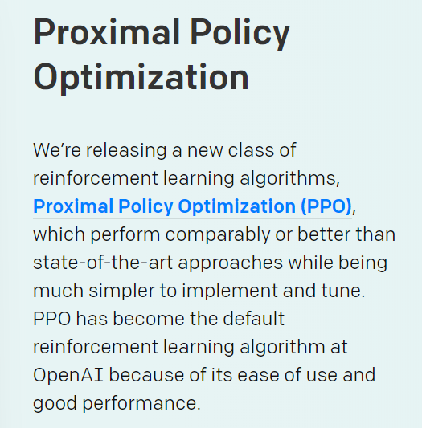 <br>


You can also check our report in the `Report&PowerPoint` directory for more detail.

## Environment
- MacOS: 10.14.1 <br>
- Unity: 2018.2.18f1 <br>
- Visual Studio: 7.6.11 <br>
- Python: 3.6 <br>
- Tensorflow: 1.7.1 <br>
- Unity ML-Agent: 0.6 <br>
- pip: 18.1 <br>

#### Quick Links
- [Unity ML-Agent Github Repostiory](https://github.com/Unity-Technologies/ml-agents)
- [Unity ML-Agent Official Website](https://unity3d.com/machine-learning/)


## User Manual

Requirement: MacOS

### Step 1
Download the Program

### Step 2
Run the Application `MazeGame_v1.0.xx.app` in the build directory. 

### Step 3
Select the Screen resolution and click play button

 <br>

### Step 4
WASD for Movement, Mouse for Rotate view. Restart button for the restart.

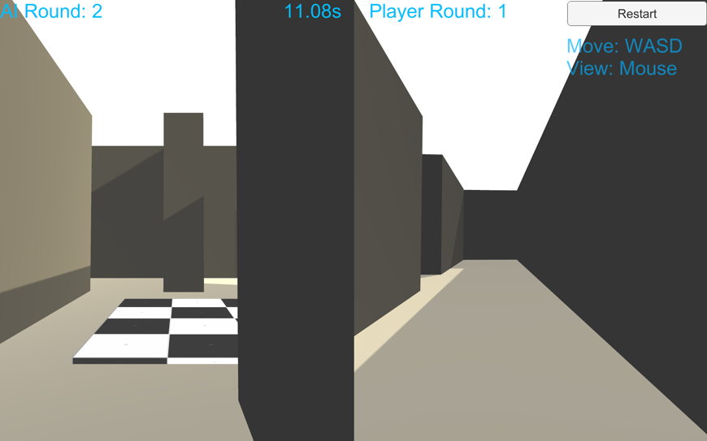 <br>


## Installation

### 1. Download ML-Agent And Set up enviorment


#### 1.1 Install Python


#### 1.2 Install Tensorflow
```bash
$ pip install tensorflow==1.7.1
```

#### 1.3 Install Unity

#### 1.4 Install ML-Agent
```bash
git clone https://github.com/Unity-Technologies/ml-agents.git
```
change to the ml-agents directory:

```bash
$ cd ml-agents/ml-agents
```

Install the package in the path.
```bash
$ pip3 install .
```

Also Follow the **Official Document** [ML-Agent Installation Guide](https://github.com/Unity-Technologies/ml-agents/blob/master/docs/) and 
[ML-Agent Basic Guide](https://github.com/Unity-Technologies/ml-agents/blob/master/docs/Basic-Guide.md) to install ML Agent


### 2. Download Maze Game in this repo

```bash
$ git clone git@github.com:tavik000/MazeGameAI.git
```

### 3. Replace the WallJump Directory

Copy the WallJump Directory to `ml-agents/UnitySDK/Assets/ML-Agents/Examples/` and Replace the original one. 

**Tips**: The WallJump is the Scene of our Maze Game, We did not change the folder name.


### 4. Open the project from Unity

Add the project to Unity from `ml-agent/UnitySDK`

Open it from Unity

Direct to the Scene of WallJump from `Assets/ML-Agents/Examples/WallJump`

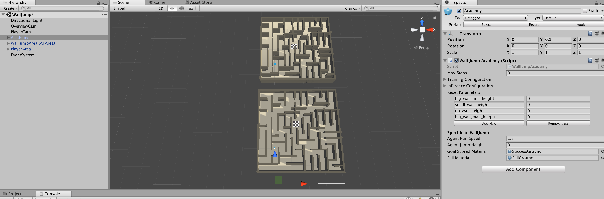 <br>


### 5. Use the Pre-Trained Model

You can use different Pre-trained model from our `TFModel` directory

#### 5.1 Change the Brain Type

For using model, you should to use the `internal` brain type.

**Important Notice**: When you want to use different model. You have to change the brain type to `external` first, then change back to `internal`. Otherwise, it will still load the previous model 

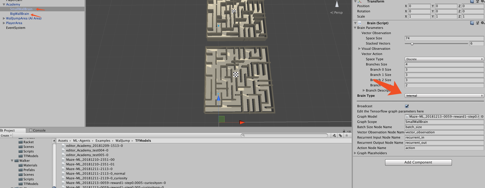 <br>

#### 5.2 Load different Model

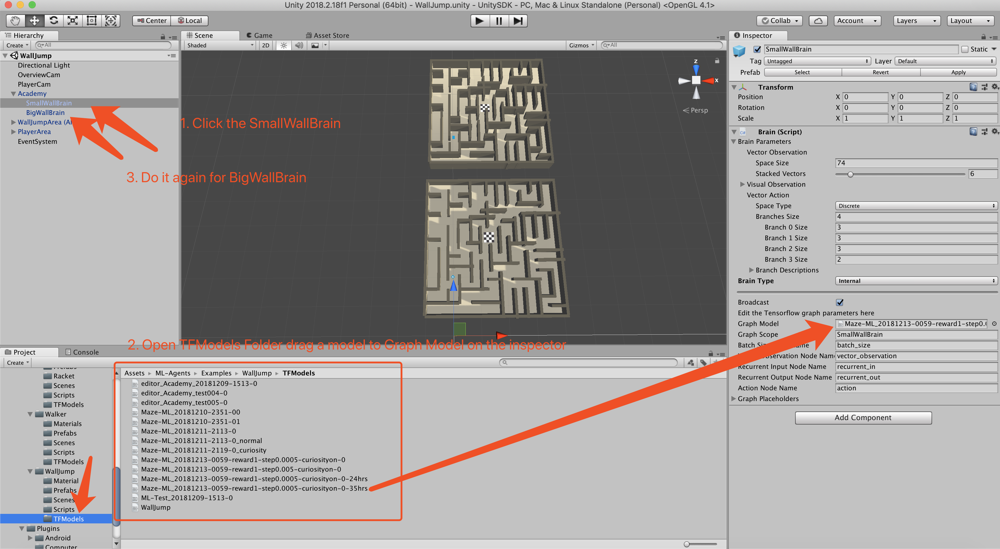 <br>


#### 5.3 Click Play Button on Unity

Click the play button for testing. When the game start, you have to check if the Graph Model is the one you want to use or there is still the previous model.

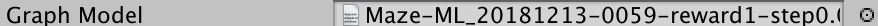 <br>

#### 5.4 Build the Game 

The game is speeded up in Unity. You can build the game to local and run.


### 6. Training

Please refer to Unity Document for more information about training.

[ML-Agent Basic Guide](https://github.com/Unity-Technologies/ml-agents/blob/master/docs/Basic-Guide.md) 


```bash 
$ mlagents-learn config/trainer_config.yaml --run-id=yourID --train
```


## Author
- [Key](https://github.com/tavik000) <br>
- [Chen Qi](https://github.com/Cqyhid) <br>
- [Karl So](https://github.com/KarlSoHelloworld) <br>
- [Wafei](https://github.com/WafeiBaBa) <br>
- [choufengpai](https://github.com/choufengpai)


## Screenshots

The Maze 
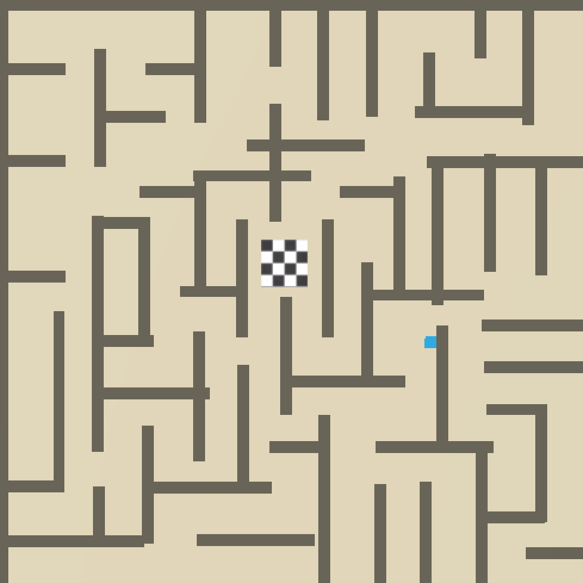 <br>
Training
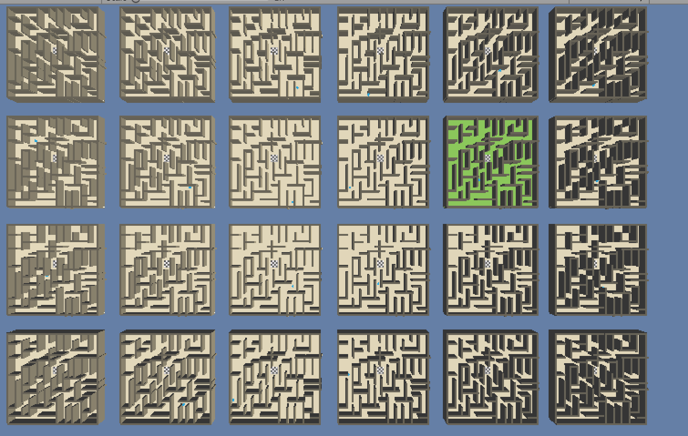 <br>
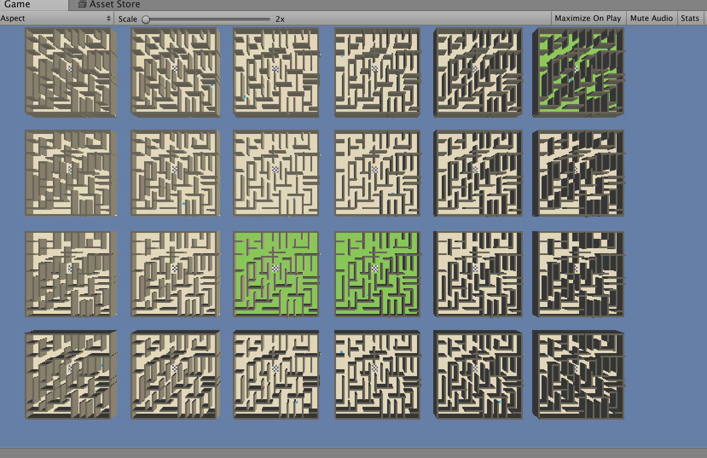 <br>
The Reward Function
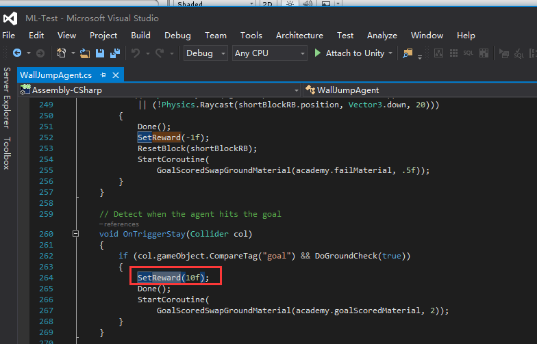 <br>
Gameplay
 <br>

Gameplay Video

[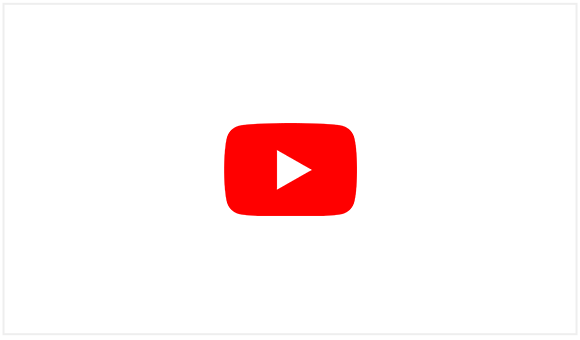](https://www.youtube.com/watch?v=EJBkXGDjS0E)


**If you like this, please leave a star.**

-----


## Contact


Email:  Key <tavik002@gmail.com>

-----
## License
MIT License

Copyright (c) 2018 key

Permission is hereby granted, free of charge, to any person obtaining a copy
of this software and associated documentation files (the "Software"), to deal
in the Software without restriction, including without limitation the rights
to use, copy, modify, merge, publish, distribute, sublicense, and/or sell
copies of the Software, and to permit persons to whom the Software is
furnished to do so, subject to the following conditions:

The above copyright notice and this permission notice shall be included in all
copies or substantial portions of the Software.

THE SOFTWARE IS PROVIDED "AS IS", WITHOUT WARRANTY OF ANY KIND, EXPRESS OR
IMPLIED, INCLUDING BUT NOT LIMITED TO THE WARRANTIES OF MERCHANTABILITY,
FITNESS FOR A PARTICULAR PURPOSE AND NONINFRINGEMENT. IN NO EVENT SHALL THE
AUTHORS OR COPYRIGHT HOLDERS BE LIABLE FOR ANY CLAIM, DAMAGES OR OTHER
LIABILITY, WHETHER IN AN ACTION OF CONTRACT, TORT OR OTHERWISE, ARISING FROM,
OUT OF OR IN CONNECTION WITH THE SOFTWARE OR THE USE OR OTHER DEALINGS IN THE
SOFTWARE.


[⬆ Back to top](#contents)

**All Copyright Reserved**
